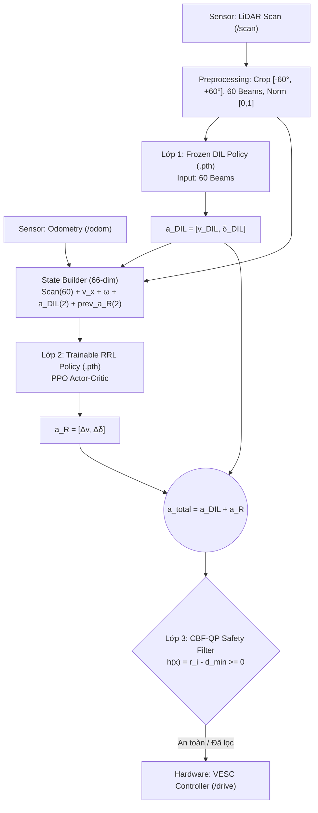

# RRL-CBF: Residual Reinforcement Learning với Control Barrier Functions cho Xe Tự Lái F1TENTH
## Tài liệu Tổng hợp Nghiên cứu & Hướng dẫn Viết Báo Khoa học

---

## 1. Tổng quan Đề tài & Đóng góp Khoa học (Paper Contribution Overview)

### 1.1 Vấn đề Nghiên cứu (Motivation & Problem Statement)
Trong đua xe tự lái tốc độ cao (Autonomous Racing), hai hướng tiếp cận phổ biến hiện nay đều tồn tại các nhược điểm cốt lõi:
1. **Deep Imitation Learning (DIL / DAgger):** 
   - **Ưu điểm:** Học nhanh, quỹ đạo lái mượt mà, bám đường tốt theo dữ liệu chuyên gia.
   - **Hạn chế:** Bị "ngưỡng chuyên gia" (Expert Bottleneck). DIL bị thụ động, chỉ lặp lại vận tốc an toàn quá mức của tài xế mẫu, khó tự gia tăng tốc độ ở các đoạn đường thẳng để tối ưu thời gian hoàn thành vòng đua (Lap Time).
2. **Pure Reinforcement Learning (RL - ví dụ PPO / SAC):**
   - **Ưu điểm:** Có khả năng tự khám phá (Exploration) để tìm ra giới hạn vận tốc tối đa.
   - **Hạn chế:** Quá trình huấn luyện từ đầu (Cold-Start) tốn thời gian, xe dễ đâm tường liên tục làm sụp đổ chính sách. Khi triển khai trên xe thật, RL thuần túy tạo ra các hành động rung giật, nguy hiểm cho phần cứng.

### 1.2 Giải pháp Đề xuất (Proposed Solution: RRL + CBF)
Đề tài đề xuất kiến trúc **Hợp nhất 3 Lớp (Three-Layer Architecture)**:
$$\mathbf{u}_{safe} = \text{CBF-QP}\Big( \mathbf{a}_{DIL}(s) + \mathbf{a}_{R}(s) \Big)$$

- **Lớp 1 - Base Policy (Frozen DIL):** Đóng vai trò là "chính sách nền tảng". Nhận input LiDAR (60 tia) và trả về lệnh cơ sở $\mathbf{a}_{DIL} = [v_{DIL}, \delta_{DIL}]$. Lớp này giữ cố định trọng số (Frozen) để đảm bảo xe luôn biết hướng di chuyển cơ bản.
- **Lớp 2 - Residual Policy (Trainable RRL PPO):** Nhận Trạng thái mở rộng 66 chiều (LiDAR, vận tốc $v_x$, vận tốc góc $\omega$, lệnh DIL, lệnh RRL trước đó) và tính ra phần bù hành động $\mathbf{a}_R = [\Delta v, \Delta \delta]$. 
- **Lớp 3 - Safety Shield (CBF-QP Filter):** Nhận lệnh tổng $\mathbf{a}_{total} = \mathbf{a}_{DIL} + \mathbf{a}_R$ và lọc qua bài toán Tối ưu Hóa Bậc Hai (Quadratic Programming) dựa trên hàm Control Barrier Function. Nếu lệnh RRL gây nguy cơ đâm tường, CBF sẽ can thiệp điều chỉnh tốc độ/góc lái về vùng an toàn thực sự trước khi xuất xuống phần cứng.

---

## 2. Sơ đồ Kiến trúc Hệ thống & Luồng Dữ liệu (System Architecture)



---

## 3. Bản đồ Mã nguồn & Vai trò các File trong Codebase

| Tên File | Thư mục | Vai trò & Chức năng trong Đề tài |
| :--- | :--- | :--- |
| `residual_env_wrapper.py` | `training/rrl/` | **Gym Environment Wrapper:** Bọc môi trường F1TENTH Gym, xây dựng không gian trạng thái 66D, tính toán gia tốc và **thiết kế hàm Reward** đa mục tiêu. |
| `rrl_model.py` | `training/rrl/` | **PyTorch Neural Network:** Xây dựng mạng `RRLActorCritic`, thực hiện **Zero-Initialization** cho Actor và hàm map hành động không đối xứng. |
| `train_ppo_rrl.py` | `training/rrl/` | **Training Pipeline:** Huấn luyện thuật toán PPO với 200k steps, rollout 2048, batch 128, entropy 0.05. |
| `cbf_core.py` | `cbf/` | **Lõi Toán học CBF:** Chứa `CBFQPSafetyFilter` giải QP qua solver `OSQP` hoặc fallback `SciPy SLSQP`. |
| `rrl_safe_controller_node.py` | `controllers/` | **ROS 2 Node Mô phỏng:** Chạy thử nghiệm và thu thập log so sánh trong môi trường Gazebo/Gym. |
| `rrl_inference_real_pytorch.py` | `ai_inference/` | **ROS 2 Node Xe Thật:** Node suy luận PyTorch độc lập 100% (Standalone), tích hợp bộ lọc mượt EMA, chạy GPU CUDA trên Jetson Xavier. |

---

## 4. Chi tiết Thuật toán & Kỹ thuật Huấn luyện (Algorithm & Implementation Tricks)

### 4.1 Chiêu thức Zero-Initialization (Tránh Sụp đổ Ban đầu)
Trong `rrl_model.py`, trọng số và bias của lớp tuyến tính cuối cùng của Actor (`self.actor_mean`) được khởi tạo hoàn toàn bằng 0:
```python
nn.init.zeros_(self.actor_mean.weight)
nn.init.zeros_(self.actor_mean.bias)
```
- **Ý nghĩa khoa học:** Tại bước huấn luyện đầu tiên ($t=0$), $\mathbf{a}_R = [0, 0] \implies \mathbf{a}_{total} = \mathbf{a}_{DIL}$. Xe bắt đầu quá trình RL từ chính năng lực ổn định của DIL chứ không bị lệch tay lái hay đâm tường vô lý (No Cold-Start Collapse).

### 4.2 Mapping Hành động Không đối xứng (Asymmetric Action Bounds)
Hành động dư $\mathbf{a}_R = [\Delta v, \Delta \delta]$ được giới hạn:
- **Tốc độ:** $\Delta v \in [-1.5\text{ m/s}, +2.5\text{ m/s}]$
  $$\Delta v = \begin{cases} \tanh(u_v) \times 2.5 & \text{khi } u_v \ge 0 \quad (\text{Tăng tốc đoạn thẳng}) \\ \tanh(u_v) \times 1.5 & \text{khi } u_v < 0 \quad (\text{Phanh gấp vào cua}) \end{cases}$$
- **Góc lái:** $\Delta \delta = \tanh(u_s) \times 0.035\text{ rad} \approx [-2.0^\circ, +2.0^\circ]$ (Giữ góc lái mượt, tránh lắc xe).
- **Kỹ thuật tránh triệt tiêu Gradient:** Thay vì dùng `torch.relu` (bị triệt tiêu đạo hàm tại 0), code sử dụng `torch.where` đảm bảo gradient luôn chảy qua điểm 0 lúc khởi tạo.

### 4.3 Thiết kế Hàm Reward Đa mục tiêu (Multi-Objective Reward Function)
Hàm Reward trong `residual_env_wrapper.py` được thiết kế cẩn thận qua nhiều phiên bản thử nghiệm:

1. **Reward Tốc độ Đoạn thẳng ($d_{front} > 3.5\text{m}$):**
   $$R_{straight} = 2.0 \times v_{cmd} - 0.5 \times (\Delta \delta)^2$$
   *Khuyến khích xe gia tăng tốc độ tối đa trên đoạn thẳng và phạt L2 việc lắc tay lái.*

2. **Reward Phanh Chủ động khi Vào Cua ($d_{front} \le 3.5\text{m}$):**
   $$R_{corner} = -3.0 \times |v_{cmd} - v_{target}|$$
   *Trong đó $v_{target} = \text{clip}(d_{front} \times 1.2, 1.0, 3.5)$. Ép xe phải phanh giảm tốc phù hợp với khoảng cách tường phía trước.*

3. **Phạt Dừng Xe (Stopping Penalty):**
   $$R_{stop} = -(0.8 - v_{cmd}) \times 3.0 \quad \text{nếu } v_{cmd} < 0.8\text{ m/s}$$
   *Ngăn chặn hiện tượng PPO học chính sách "đứng yên một chỗ" để tránh bị phạt.*

4. **Phạt Giật Lái (Jerk Penalty):**
   $$R_{jerk} = -0.2 \times \|\mathbf{a}_R^{(t)} - \mathbf{a}_R^{(t-1)}\|^2$$
   *Đảm bảo tín hiệu điều khiển mượt mà khi xuất xuống xe thật.*

---

## 5. Kết quả Thực nghiệm trên Xe Thật & Bài học Phần cứng (Real Hardware Results)

### 5.1 Kết quả Đạt được trên Xe Thật (Nvidia Jetson Xavier)
- **Tốc độ vận hành ổn định:** Đạt **$v_{max} = 2.5\text{ m/s}$** trên cứng xe thật (so với DIL cơ sở chỉ chạy $1.5\text{ -- }1.8\text{ m/s}$).
- **Độ an toàn:** $0\%$ va chạm nhờ bộ lọc CBF-QP hoạt động thời gian thực tại tần số 20Hz.
- **Thời gian hoàn thành vòng đua (Lap Time):** Giảm đáng kể nhờ RRL biết chủ động tăng tốc lên $2.5\text{ m/s}$ ở đoạn thẳng và tự phanh về $1.2 - 1.5\text{ m/s}$ khi áp sát cua.

### 5.2 Phân tích Nghịch lý Tần số (Hardware Response Lag vs Simulation)
- **Trên Mô phỏng (Sim):** Tần số vật lý là 50Hz, không có độ trễ truyền thông hay quán tính động cơ. Xe có thể đẩy tốc độ lên $5.0 - 7.0\text{ m/s}$.
- **Trên Xe thật (Xavier + VESC + Hokuyo/RPLiDAR):** Tần số thực tế của luồng LiDAR và đáp ứng VESC đạt khoảng 20Hz. Đồng thời cơ cấu lái có độ rơ và độ trễ cơ học.
- **Kết luận Thực nghiệm:** Giới hạn $v_{max} = 2.5\text{ m/s}$ trên xe thật là **mức vận tốc tối ưu nhất**, đảm bảo vừa nâng cao hiệu suất so với DIL, vừa nằm trong vùng phản hồi an toàn của hệ thống cơ điện tử.

---

## 6. Các Bài báo Tham khảo Uy tín (Literature & Recommended Citations)

Khi viết báo khoa học, bạn nên trích dẫn các công trình nền tảng sau:

1. **Về Residual Reinforcement Learning (RRL):**
   - **Johannink et al. (2019)**, *"Residual Reinforcement Learning for Robot Control"*, IEEE International Conference on Robotics and Automation (ICRA). *(Bài báo tiên phong đề xuất ý tưởng kết hợp Controller truyền thống và RL)*.
   - **Silver et al. (2018)**, *"Residual Policy Learning"*, arXiv:1812.06298.

2. **Về Control Barrier Functions (CBF):**
   - **Ames et al. (2019)**, *"Control Barrier Functions: Theory and Applications"*, IEEE European Control Conference (ECC). *(Tài liệu chuẩn mực về lý thuyết CBF-QP)*.
   - **Choi et al. (2020)**, *"Reinforcement Learning with Control Barrier Functions for Safe Navigation"*, IEEE RO-MAN.

3. **Về Autonomous Racing & Imitation Learning (F1TENTH):**
   - **O’Kelly et al. (2020)**, *"F1TENTH: An Open-Source Evaluation Environment for Autonomous Racing"*, IEEE International Conference on Robotics and Automation (ICRA).
   - **Ross et al. (2011)**, *"A Reduction of Imitation Learning and Structured Prediction to No-Regret Online Learning"* (Algorithmic foundation of DAgger), AISTATS.
