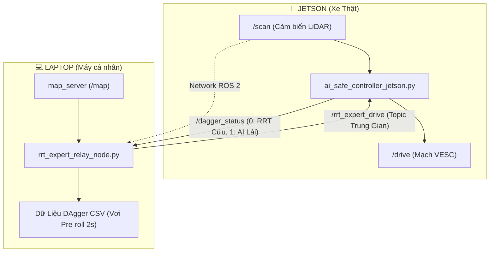

# Kế Hoạch Kiến Trúc DAgger Phân Tán (Distributed DAgger Architecture)

## 📌 Tổng Quan Kiến Trúc
Tách biệt hoàn toàn công việc giữa **Máy Laptop (chạy RRT* nặng & Lưu Dataset CSV)** và **Xe Jetson (chạy AI Inference siêu nhẹ & Điều khiển xe)** thông qua các ROS 2 Topic trung gian.

---

## 🛠️ Các File Sẽ Tạo Và Chỉnh Sửa

### 1. [NEW] `rrt_expert_relay_node.py` (Chạy trên Laptop)
* **Nguồn:** Copy từ `code_chay_reak.py` (giữ nguyên 100% thuật toán RRT* né vật cản).
* **Thay đổi:**
  - Không publish trực tiếp vào `/drive`. Chuyển sang publish lệnh Chuyên gia vào Topic Trung Gian: **`/rrt_expert_drive`** (`ackermann_msgs/msg/AckermannDriveStamped`).
  - Subscribe topic **`/dagger_status`** (`std_msgs/msg/Int32`):
    * Khi nhận `status == 0` (RRT* đang cứu xe) ➔ Kích hoạt ghi dữ liệu DAgger (với Pre-roll 2 giây quá khứ) trực tiếp vào file CSV trên Laptop.
    * Khi nhận `status == 1` (AI tự lái) ➔ Không ghi dữ liệu.

### 2. [NEW] `ai_safe_controller_jetson.py` (Chạy trên Jetson)
* **Nhiệm vụ:** Siêu gọn nhẹ, chỉ đảm nhận 3 việc:
  1. Suy luận AI PyTorch từ `/scan`.
  2. Đọc lệnh Chuyên gia RRT* từ topic trung gian `/rrt_expert_drive`.
  3. So sánh `abs(ai_steer - rrt_steer) > override_threshold`:
     * Nếu **AI lái** (`<= threshold`) ➔ Gửi lệnh AI lên `/drive`, phát status `1` lên `/dagger_status`.
     * Nếu **RRT* Cứu** (`> threshold`) ➔ Gửi lệnh RRT* lên `/drive`, phát status `0` lên `/dagger_status`.

---

## 📋 Danh Sách File Liên Quan

#### [NEW] [rrt_expert_relay_node.py](file:///home/adt/f1_ws/src/pure_pursuit_controller/rrt_planner/rrt_expert_relay_node.py)
#### [NEW] [ai_safe_controller_jetson.py](file:///home/adt/f1_ws/src/pure_pursuit_controller/pure_pursuit_controller/controllers/ai_safe_controller_jetson.py)
#### [MODIFY] [CMakeLists.txt](file:///home/adt/f1_ws/src/pure_pursuit_controller/CMakeLists.txt)

---

## 🧪 Kế Hoạch Kiểm Tra & Xác Nhận (Verification Plan)

### 1. Kiểm tra Biên dịch & Cú pháp:
* Chạy `python3 -c "import ast; ast.parse(...)"` để kiểm tra cú pháp 2 node mới.
* Chạy `colcon build --packages-select pure_pursuit_controller` thành công.

### 2. Kiểm tra Luồng Truyền Tin (Topic Communication):
* Kiểm tra tin nhắn trung gian `/rrt_expert_drive` và `/dagger_status` phát nhận chính xác giữa 2 node.
